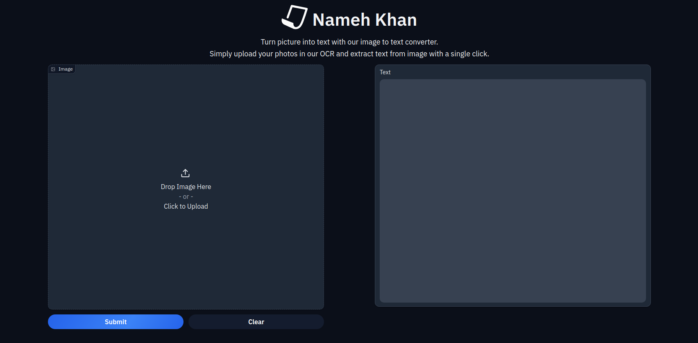

# Nameh-Khan
## Environment Set up
### Python  
To use this tool, you should have python >= 3.10. So, in the first step, install python 3.10 on your system. 

You can install python 3.10 by: 
- Download and install python release from [here](https://www.python.org/downloads/). 
- Download and install anaconda from [here](https://anaconda.org/anaconda/python/files?version=3.10.0).

### Poetry 
To manage this project's dependencies and packaging, we use [Poetry](https://python-poetry.org/).

#### Set up
1) Install Poetry with this command. 
```
pip install poetry==1.8.4
```
2) Check the poetry version. 
```
poetry --version
```
You should see `Poetry (version 1.8.4)`. 
3) Change your directory to `[Path to Project Root]/lib/nameh-khan`. 
```
cd lib/nameh-khan
```
4) Create virtual env by running this command: 
```
poetry shell
```

Done. :white_check_mark:

#### Installing dependencies
After creating your virtual env, every time you change your path to `[Path to Project Root]/lib/nameh-khan` you should activate the environment. 
You can activate the environment with these commands:
```commandline
poetry shell
```
or 
```commandline
source "$( poetry env info --path )/bin/activate"
```

After activating the environment you should install dependencies with this command: 
```
poetry install 
```
**Note**: If you want to see more details of installation you can use this command: 
```
poetry install -vvv 
```
Poetry will resolve and install the required packages and their dependencies.
Done. :white_check_mark:

## Building Library  
To build a `.whl` file of the library, you should follow these steps: 
1) Change your directory to `[Path to Project Root]/lib/nameh-khan`. 
```
cd lib/nameh-khan
```
2) Build the library by running this command:  
```
poetry build
```

This will create a `dist` folder in your path. In this folder you can find the `.whl` file of library. 
You can install this library by running this command: 
```
pip install dist/nameh_khan-0.1.0-py3-none-any.whl
```

## Running Demo 
To run the demo you should follow these steps: 
1) Change your directory to `[Path to Project Root]/lib/nameh-khan`
```
cd lib/nameh-khan
```
2) Activate the environment
```commandline
poetry shell
```
or 
```commandline
source "$( poetry env info --path )/bin/activate"
```
3) Install dependencies (Note: If you do it one time you can skip this step in the next time.)
```
poetry install 
```
4) Change your directory to root of the project:
```
cd ../..
```
5) Run the below command: 
```commandline
PYTHONPATH=lib/nameh-khan/ python demo/app.py
```

Now you can see the app on port 7860 of your system. Open your browser and open this url: `http://127.0.0.1:7860/?__theme=dark`.
You should see a page like the below image. 



In this page you can upload the image samples in the `samples` folder and check the output. 